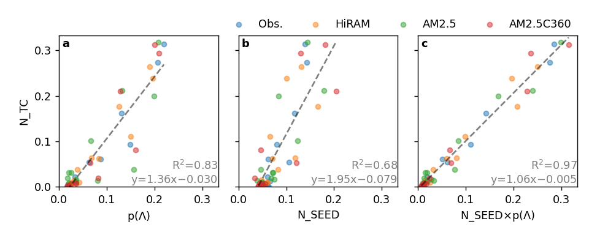
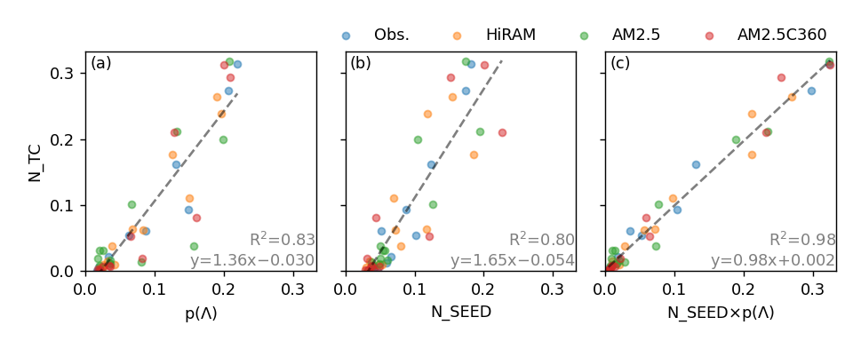

# scripts, data and figures for the tropical cyclone annual cycle study

## note
wyfig*.py: scripts for the main figures

wyfig*.nc: data for the main figures

wyfig*.png: figures for the main figures

sifig*.py: scripts for the supplementary figures

sifig*.nc: data for the supplementary figures

sifig*.png: supplementary figures

## old note
v2 (2020-10-13): add AM2.5 and AM2.5C360
*_rainy version: seed tracked using Tsung-Lin's method (Hsieh et al. 2020) instead of Lucas' method (Harris et al. 2016)
v3 (2020-11-25): AM2.5C360 seeds use vorticity threshold of 8e-4 instead of 4e-4
v4 (2020-12-08): data in scatter plots are normalized by annual total
v4p1 (2020-12-08): scatter plots from obs and models merged

*_olife24hr*: track has over 24 hours over ocean grids

*_5N*: genesis probability averaged over 5-30N(S) instead of the default 10-30N(S)

wyfig??_* are new versions that replace wyFig??.*

## list of figures

* [wyfig01_barline_cycle_ntc_pTang.py](wyfig01_barline_cycle_ntc_pTang.py}

[wyfig01_barline_cycle_ntc_pTang.pdf](wyfig01_barline_cycle_ntc_pTang.pdf)

* [wyfig01a_barline_cycle_ntc_pTang.py](wyfig01a_barline_cycle_ntc_pTang.py)

[wyfig01a_barline_cycle_ntc_pTang.NA.nc](wyfig01a_barline_cycle_ntc_pTang.NA.nc)

* [wyfig01b_bar_cycle_ntc_pTang_sharpness.py](wyfig01b_bar_cycle_ntc_pTang_sharpness.py)

[wyfig01b_bar_cycle_ntc_pTang_sharpness.NA.csv](wyfig01b_bar_cycle_ntc_pTang_sharpness.NA.csv)

* [wyfig01c_bar_cycle_ntc_pTang_dfrac.py](wyfig01c_bar_cycle_ntc_pTang_dfrac.py)

[wyfig01c_bar_cycle_ntc_pTang_dfrac.NA.csv](wyfig01c_bar_cycle_ntc_pTang_dfrac.NA.csv)

* [wyfig02_barline_ntc_predicted.py](wyfig02_barline_ntc_predicted.py)

[wyfig02_barline_ntc_predicted.pdf](wyfig02_barline_ntc_predicted.pdf)

* [wyfig02a_barline_cycle_ntc_predicted_obs.py](wyfig02a_barline_cycle_ntc_predicted_obs.py)

[wyfig02a_barline_cycle_ntc_predicted_obs.NA.nc](wyfig02a_barline_cycle_ntc_predicted_obs.NA.nc)

* [wyfig02b_barline_cycle_ntc_predicted_hiram.py](wyfig02b_barline_cycle_ntc_predicted_hiram.py)

[wyfig02b_barline_cycle_ntc_predicted_hiram.NA.nc](wyfig02b_barline_cycle_ntc_predicted_hiram.NA.nc)

* [wyfig02c_barline_cycle_ntc_predicted_am2p5.py](wyfig02c_barline_cycle_ntc_predicted_am2p5.py)

[wyfig02c_barline_cycle_ntc_predicted_am2p5.NA.nc](wyfig02c_barline_cycle_ntc_predicted_am2p5.NA.nc)

* [wyfig02d_barline_cycle_ntc_predicted_am2p5c360.py](wyfig02d_barline_cycle_ntc_predicted_am2p5c360.py)

[wyfig02d_barline_cycle_ntc_predicted_am2p5c360.NA.nc](wyfig02d_barline_cycle_ntc_predicted_am2p5c360.NA.nc)

* [wyfig03_scatter_ntc_vs_all.py](wyfig03_scatter_ntc_vs_all.py)

[wyfig03_scatter_ntc_vs_all.pdf](wyfig03_scatter_ntc_vs_all.pdf)
[wyfig03_scatter_ntc_vs_all.NA.nc](wyfig03_scatter_ntc_vs_all.NA.nc)

* [wyfig04_scatter_ntc_vs_all_mbasins.py](wyfig04_scatter_ntc_vs_all_mbasins.py)

[wyfig04_scatter_ntc_vs_all_mbasins.pdf](wyfig04_scatter_ntc_vs_all_mbasins.pdf)
[wyfig04_scatter_ntc_vs_all_mbasins.nc](wyfig04_scatter_ntc_vs_all_mbasins.nc)

* [sifig01_cycle_ntc_pTang_ratio_dfrac_alt_am2p5.py](sifig01_cycle_ntc_pTang_ratio_dfrac_alt_am2p5.py)

[sifig01_cycle_ntc_pTang_ratio_dfrac_alt_am2p5.NA.ntc.obs.nc](sifig01_cycle_ntc_pTang_ratio_dfrac_alt_am2p5.NA.ntc.obs.nc)
[sifig01_cycle_ntc_pTang_ratio_dfrac_alt_am2p5.NA.p.obs.nc](sifig01_cycle_ntc_pTang_ratio_dfrac_alt_am2p5.NA.p.obs.nc)
[sifig01_cycle_ntc_pTang_ratio_dfrac_alt_am2p5.NA.ntc.am2p5.nc](sifig01_cycle_ntc_pTang_ratio_dfrac_alt_am2p5.NA.ntc.am2p5.nc)
[sifig01_cycle_ntc_pTang_ratio_dfrac_alt_am2p5.NA.p.am2p5.nc](sifig01_cycle_ntc_pTang_ratio_dfrac_alt_am2p5.NA.p.am2p5.nc)

* [sifig02_cycle_ntc_pTang_ratio_dfrac_alt_am2p5c360.py](sifig02_cycle_ntc_pTang_ratio_dfrac_alt_am2p5c360.py)

[sifig02_cycle_ntc_pTang_ratio_dfrac_alt_am2p5c360.NA.ntc.obs.nc](sifig02_cycle_ntc_pTang_ratio_dfrac_alt_am2p5c360.NA.ntc.obs.nc)
[sifig02_cycle_ntc_pTang_ratio_dfrac_alt_am2p5c360.NA.p.obs.nc](sifig02_cycle_ntc_pTang_ratio_dfrac_alt_am2p5c360.NA.p.obs.nc)
[sifig02_cycle_ntc_pTang_ratio_dfrac_alt_am2p5c360.NA.ntc.am2p5c360.nc](sifig02_cycle_ntc_pTang_ratio_dfrac_alt_am2p5c360.NA.ntc.am2p5c360.nc)
[sifig02_cycle_ntc_pTang_ratio_dfrac_alt_am2p5c360.NA.p.am2p5c360.nc](sifig02_cycle_ntc_pTang_ratio_dfrac_alt_am2p5c360.NA.p.am2p5c360.nc)

* [sifig03_cycle_mdrsst.py](sifig03_cycle_mdrsst.py)

[sifig03_cycle_mdrsst.nc](sifig03_cycle_mdrsst.nc)

* [sifig04_bar_ratio.py](sifig04_bar_ratio.py)

[sifig04_bar_ratio.ASO2otherMonths.nc](sifig04_bar_ratio.ASO2otherMonths.nc)

* [sifig04_bar_ratio.py](sifig04_bar_ratio.py)

[sifig05_bar_ratio.dAugfrac.nc](sifig05_bar_ratio.dAugfrac.nc)

* [sifig06_maps_jaso_obs_rainy.py](sifig06_maps_jaso_obs_rainy.py)

[sifig06_maps_jaso_obs_rainy.tcgenesis.nc](sifig06_maps_jaso_obs_rainy.tcgenesis.nc)
[sifig06_maps_jaso_obs_rainy.seed.nc](sifig06_maps_jaso_obs_rainy.seed.nc)
[sifig06_maps_jaso_obs_rainy.p.nc](sifig06_maps_jaso_obs_rainy.p.nc)

* [sifig07_maps_jaso_hiram_rainy.py](sifig07_maps_jaso_hiram_rainy.py)

[sifig07_maps_jaso_hiram_rainy.tcgenesis.nc](sifig07_maps_jaso_hiram_rainy.tcgenesis.nc)
[sifig07_maps_jaso_hiram_rainy.seed.nc](sifig07_maps_jaso_hiram_rainy.seed.nc)
[sifig07_maps_jaso_hiram_rainy.p.nc](sifig07_maps_jaso_hiram_rainy.p.nc)

* [sifig08_maps_jaso_am2p5_rainy.py](sifig08_maps_jaso_am2p5_rainy.py)

[sifig08_maps_jaso_am2p5_rainy.tcgenesis.nc](sifig08_maps_jaso_am2p5_rainy.tcgenesis.nc)
[sifig08_maps_jaso_am2p5_rainy.seed.nc](sifig08_maps_jaso_am2p5_rainy.seed.nc)
[sifig08_maps_jaso_am2p5_rainy.p.nc](sifig08_maps_jaso_am2p5_rainy.p.nc)

* [sifig09_maps_jaso_am2p5c360_rainy.py](sifig09_maps_jaso_am2p5c360_rainy.py)

[sifig09_maps_jaso_am2p5c360_rainy.tcgenesis.nc](sifig09_maps_jaso_am2p5c360_rainy.tcgenesis.nc)
[sifig09_maps_jaso_am2p5c360_rainy.seed.nc](sifig09_maps_jaso_am2p5c360_rainy.seed.nc)
[sifig09_maps_jaso_am2p5c360_rainy.p.nc](sifig09_maps_jaso_am2p5c360_rainy.p.nc)

* [sifig10_bar_sharpness_tchumh.py](sifig10_bar_sharpness_tchumh.py)

[sifig10_bar_sharpness_tchumh.NA.csv](sifig10_bar_sharpness_tchumh.NA.csv)

* [sifig11_cycle_pTangs_decom.py](sifig11_cycle_pTangs_decom.py)

[sifig11_cycle_pTangs_decom.NA.nc](sifig11_cycle_pTangs_decom.NA.nc)

* [sifig12_omega500Z_cycle.py](sifig12_omega500Z_cycle.py)

[sifig12_omega500Z_cycle.nc](sifig12_omega500Z_cycle.nc)

* [sifig13_scatter_ntc_vs_all_v4p1_alt_0p5xvort.py](sifig13_scatter_ntc_vs_all_v4p1_alt_0p5xvort.py)

[sifig13_scatter_ntc_vs_all_v4p1_alt_0p5xvort.NA.nc](sifig13_scatter_ntc_vs_all_v4p1_alt_0p5xvort.NA.nc)

* [sifig14_scatter_ntc_vs_all_v4p1_alt_1p5xvort.py](sifig14_scatter_ntc_vs_all_v4p1_alt_1p5xvort.py)

[sifig14_scatter_ntc_vs_all_v4p1_alt_1p5xvort.NA.nc](sifig14_scatter_ntc_vs_all_v4p1_alt_1p5xvort.NA.nc)

* [sifig15_scatter_ntc_vs_all_v4p1_alt_olife24hr.py](sifig15_scatter_ntc_vs_all_v4p1_alt_olife24hr.py)

[sifig15_scatter_ntc_vs_all_v4p1_alt_olife24hr.NA.nc](sifig15_scatter_ntc_vs_all_v4p1_alt_olife24hr.NA.nc)

* [sifig16_scatter_ntc_vs_all_v4p1_alt_LucasTracker.py](sifig16_scatter_ntc_vs_all_v4p1_alt_LucasTracker.py)

[sifig16_scatter_ntc_vs_all_v4p1_alt_LucasTracker.NA.nc](sifig16_scatter_ntc_vs_all_v4p1_alt_LucasTracker.NA.nc)

* [sifig17_scatter_ntc_vs_all_v4p1_alt_5N.py](sifig17_scatter_ntc_vs_all_v4p1_alt_5N.py)

[sifig17_scatter_ntc_vs_all_v4p1_alt_5N.NA.nc](sifig17_scatter_ntc_vs_all_v4p1_alt_5N.NA.nc)
